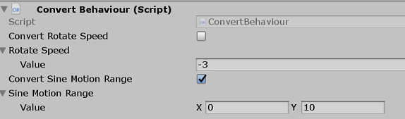
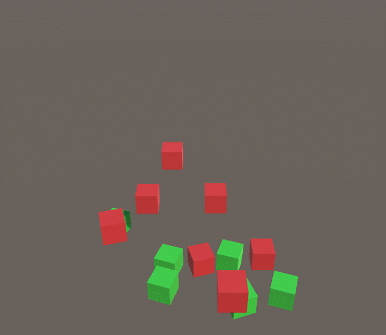

# Unity DOTS(二) ECS编码示例
先在Unity创建一个ECS示例（Unity版本2019.1.0f2,Entitis版本0.0.12 preview.33）。在场景中创建一些立方体（Cube），给所有对象加上ConvertToEntity,然后Play。这时候场景显示没什么异常但Hierarchy中的对象消失了，因为ECS通过ConvertToEntity组件把GameObject转成Entity+Component了，而当前版本还不能在Hierarch中显示Entiy。 Unity另外提供Entity Debugger工具查看运行中Entity信息。

再来看看怎么控制这些立方体。在项目中新建一个C#代码文件，代码如下：
```C#
using Unity.Burst;
using Unity.Entities;
using Unity.Jobs;
using Unity.Mathematics;
using Unity.Transforms;
using UnityEngine;

public class RotateSystem : JobComponentSystem
{
    [BurstCompile]
    struct RotateJob : IJobForEach<Rotation>
    {
        public float dt;
        public void Execute(ref Rotation rotation)
        {
            rotation.Value = math.mul(rotation.Value, quaternion.RotateY(1f* dt));
        }
    }

    protected override JobHandle OnUpdate(JobHandle inputDeps)
    {
        var rotateJob = new RotateJob();
        rotateJob.dt = Time.deltaTime;
        return rotateJob.Schedule(this,inputDeps);
    }
}
```
Play后应该看到所有对象以每秒1弧度速度顺时针旋转。简单解释下这个代码，JobComponentSystem就是ECS中的S，基类是ComponentSystemBase抽象类，有很多实现，这篇文章不展开S部分只先看看JobComponentSystem。其中OnUpdate是每帧执行的，也是一个System逻辑入口，传入JobHandle是用于ECS底层处理System依赖关系等逻辑的句柄，内部RotateJob逻辑就是一个Job(参考Unity DOTS(一))，这个Job实现IJobForEach接口，IJobForEach是ECS底层的封装，有多种泛型实现，它相当于向系统声明这个ComponentSystem需要所有Entity中包含Rotation组件的Rotation数据。


我们再扩充一下这个示例，创建自定义的Component，再加个System控制Cube上下移动。

先定义两个Component。RotateSpeed用于将RotateSystem中写死的旋转速度独立出来，使它可以配置或修改。SineMotionRange用于配置新的System中上下运动的范围。
```C#
public struct RotateSpeed : IComponentData
{
    public float Value;
}
public struct SineMotionRange : IComponentData
{
    public float2 Value;
}
```

修改下RotateSystem让RotateSpeed生效。这里只需要修改RotateJob，在IJobForEach泛型里加入RotateSpeed类型，并在Execute方法中访问它。
```C#
struct RotateJob : IJobForEach<Rotation, RotateSpeed>
{
    public float dt;
    public void Execute(ref Rotation rotation, ref RotateSpeed speed)
    {
        rotation.Value = math.mul(rotation.Value, quaternion.RotateY(speed.Value* dt));
    }
}
```

而上下移动的SineMotionSystem结构是一样的，实现逻辑在Execute中，具体的逻辑可以根据想要的效果进行处理，这里传入Time.time,用正sin函数进行上下摆动。
```C#
struct SineMotionJob : IJobForEach<Translation, SineMotionRange>
{
    public float time;

    public void Execute(ref Translation pos, [ReadOnly] ref SineMotionRange range)
    {
        var sin = math.sin(time);
        sin *= sin;
        pos.Value.y = sin * (range.Value.y - range.Value.x) + range.Value.x;
    }
}
```

到这里Component和System代码都有了，但自定义的Component数据并没添加到Cube。当前版本想要在编辑器中可视化添加Component还需要借助ConvertToEntity,ConvertToEntity除了会将GameObject中的transform和Mesh Renderer转成ECS中的Component外还会调用实现IConvertGameObjectToEntity的MonoBehaviour中的Convert方法。
```C#
public class ConvertBehaviour : MonoBehaviour, IConvertGameObjectToEntity
{
    public bool ConvertRotateSpeed = false;//是否对RotateSpeed转换的开关
    public RotateSpeed RotateSpeed;

    public bool ConvertSineMotionRange = false; //是否对SineMotionRange转换的开关
    public SineMotionRange SineMotionRange;

    public void Convert(Entity entity, EntityManager dstManager, GameObjectConversionSystem conversionSystem)
    {
        if (ConvertRotateSpeed) dstManager.AddComponentData(entity, RotateSpeed);
        if (ConvertSineMotionRange) dstManager.AddComponentData(entity, SineMotionRange);
    }
}
```
将ConvertBehaviour挂到Cube上, 并修改下值不同的值。  
  
运行效果：  



如果你熟悉GameObject/MonoBehaviour编码方式的话这些代码可能不会让你喜欢，因为创建两个MonoBehaviour文件很少几行代码就可以完成同样的功能，而这里可能需要五个文件近百行代码，而且很多Unity的使用方式都变了，连改变坐标都是新的方式。当然，Unity宣传的性能提升对程序员有很强的吸引力，但如果你的项目的性能瓶颈不在CPU，ECS是否还有吸引力？个人觉得还是有的，因为在游戏开发中组合是远优于继承的，ECS又把数据组合发挥到极致，Unity官方称之为Data-Oriented(数据导向)。但这可能也正是ECS一大缺点，因为OOP更接近人类本能的认知方式。<!--我们很小就会区分植物动物，爬行动物哺乳动物，猫科犬科，一切自然又好用，但如果更深入一些了解生物分类的话就会发现一点都不美好，纲目科属等等非常繁琐，而且有时候还影响认知，比如食肉目下的犬科有一种就主要吃素。-->


数据导向设计在ECS的应用中主要考虑的就是组件的拆分和ComponentSystem之间的依赖关系。组件拆分的原则是尽量原子化，使代码不需要对组件数据进行if判断和System关注的数据没有冗余数据。比如有一个IComponentData有颜色和形状两个字段，System的逻辑处理只和颜色有关，那么形状数据就冗余了，颜色和形状可以拆分，就像Transform分成位置、旋转和缩放三个组件。如果逻辑中要对红色做专门处理，就需要考虑下红色特殊性是否可以有其它表达，ECS推荐的方式是加一个无数据的IComponentData来标记。这种拆分既更好地应对需求变化也能提高程序性能(CPU分支预测和载入CPU缓存的数据量)。ComponentSystem之间的依赖肯定也少也好，不依赖的System能够很好并行也方便重构和优化，依赖问题也主要靠数据组件的设计，有时候通过处理数据组件并增加System可以很好的处理复杂的藕合问题。

我们再根据数据导向设计原则再处理下示例的代码。SineMotionRange组件是和SineMotionSystem直接相关的，可以进行下处理，把上下的运动范围和运动方式分离。
```C#
public struct MotionRange : IComponentData
{
    public float2 Value;
}
public struct SineTag : IComponentData
{
}
```
另外需要在SineMotionJob上加个RequireComponentTag标记，表示Entity必须包含SineTag组件才会被选择
```C#
 [RequireComponentTag(typeof(SineTag))]
```
这两者分离后可以加入更多的运动方式和运动范围的组合，上下范围弹动，正弦波处理的缩放等等。


以上就是一个ECS的简单示例。数据导向设计只是一点个人看法，程序设计需要具体场合分析与权衡，这里仅供参考。ECS性能方面的优点和细节列些参考在后面。


[详解实体组件系统ECS](https://connect.unity.com/p/xiang-jie-shi-ti-zu-jian-xi-tong-ecs)  官方的介绍，前半部分有关于内存方面的简单介绍

[Unity ECS框架Entities源码解析](https://blog.csdn.net/yudianxia/article/details/84871243)  一共有四篇，使用的ECS版本较老，有些实现有所改动，但整体架构内存布局可以参考。

[gametorrahod.com](https://gametorrahod.com/tag/unity-ecs/) 有关于ECS一些技术细节的文章


[官方文档](https://docs.unity3d.com/Packages/com.unity.entities@0.0/manual/index.html) 

